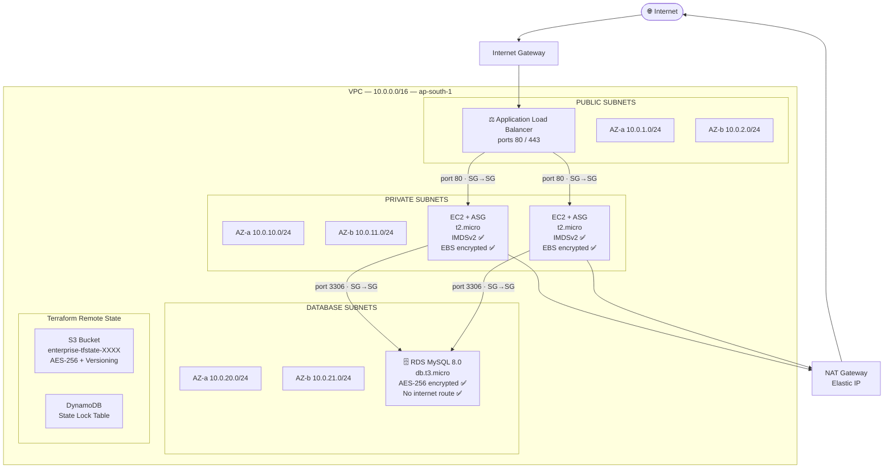
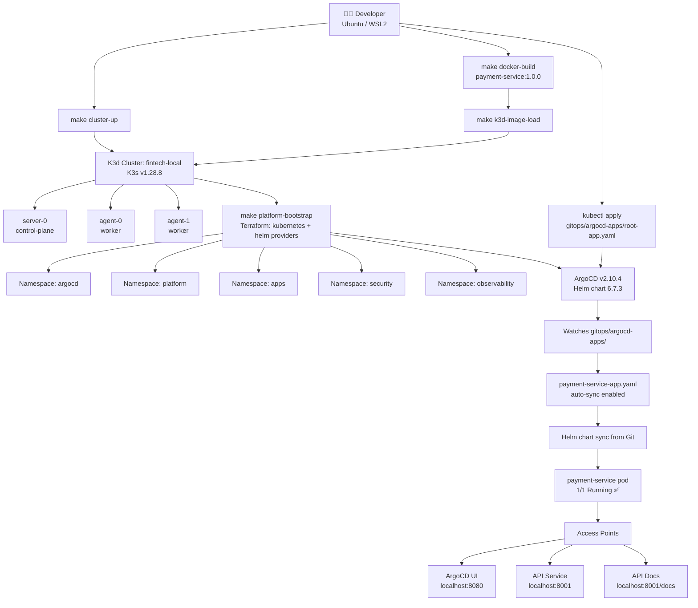
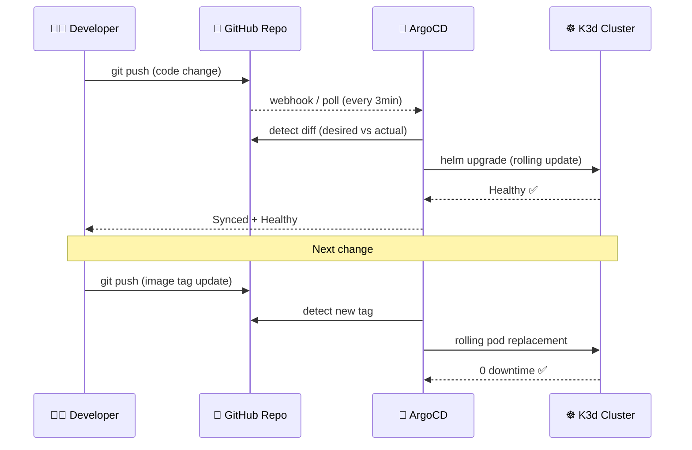
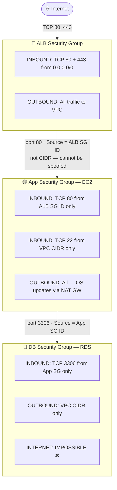
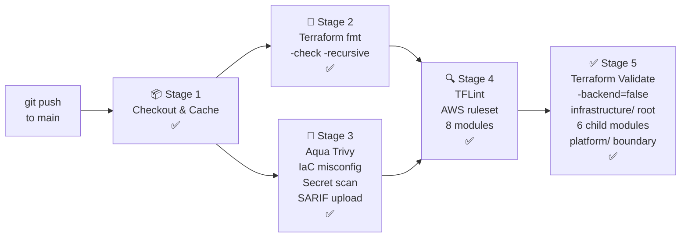
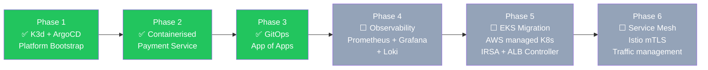

<div align="center">

# 🏦 FinTech Cloud-Native Platform

### Enterprise Infrastructure as Code + GitOps Delivery

[](https://www.terraform.io/)
[](https://aws.amazon.com/)
[](https://kubernetes.io/)
[](https://argo-cd.readthedocs.io/)
[](https://www.docker.com/)
[](https://fastapi.tiangolo.com/)
[](https://github.com/features/actions)
[](LICENSE)

> **From AWS Infrastructure as Code to containerised GitOps delivery.**
> Production engineering patterns. Local-first execution. Zero cloud waste.

**Built to reflect 9–15 LPA Platform Engineering maturity.**

</div>

---

## 📋 Table of Contents

- [What This Project Demonstrates](#-what-this-project-demonstrates)
- [Architecture Overview](#️-architecture-overview)
- [Security Architecture](#-security-architecture)
- [Repository Structure](#-repository-structure)
- [DevSecOps Pipeline](#-devsecops-pipeline)
- [Application — Payment Service](#-application--fintech-payment-service)
- [Prerequisites](#️-prerequisites)
- [Quick Start](#-quick-start)
- [Makefile Reference](#-makefile-reference)
- [Multi-Environment Strategy](#-multi-environment-strategy)
- [Cost Analysis](#-cost-analysis)
- [Tech Stack](#️-tech-stack)
- [Troubleshooting](#-troubleshooting)
- [Roadmap](#️-roadmap)

---

## 🎯 What This Project Demonstrates

A complete **cloud-native platform engineering stack** — from AWS infrastructure provisioning with Terraform to containerised microservice delivery via GitOps. Built local-first to eliminate cloud experimentation cost while preserving every production operational pattern.

| Skill Domain | What Was Built |
|---|---|
| **Infrastructure as Code** | Modular AWS Terraform — 6 custom modules, S3 remote state, DynamoDB locking, multi-environment tfvars |
| **DevSecOps Pipeline** | GitHub Actions — 5 stages — Trivy IaC scan + TFLint + Validate — zero AWS credentials needed |
| **Container Engineering** | Multi-stage Dockerfile — non-root user `uid=1001`, OCI labels, HEALTHCHECK, read-only filesystem |
| **Kubernetes** | K3d local cluster — namespaces, Helm releases, NGINX Ingress, liveness + readiness probes |
| **GitOps** | ArgoCD App of Apps — automated sync, selfHeal, prune — Git is single source of truth |
| **Platform Engineering** | Makefile-driven developer workflow — `make restart` restores full platform after reboot |
| **Cloud Security** | IMDSv2, SG-to-SG chain, least-privilege IAM, Secrets Manager, no hardcoded credentials |
| **FinTech Application** | FastAPI payment service — correlation ID middleware, Pydantic validation, structured JSON logging |

---

## 🏛️ Architecture Overview

### The Four Boundaries — Mono-Repo Design

| Boundary | Path | Purpose |
|---|---|---|
| 🏗️ Infrastructure | `infrastructure/` | AWS Terraform — production cloud foundation |
| 🔧 Platform | `platform/` | Local K8s bootstrap via Terraform + Helm |
| 📦 Application | `applications/` | FinTech microservice — Docker + Helm chart |
| 🔄 GitOps | `gitops/` | ArgoCD manifests — automated delivery layer |

---

### AWS 3-Tier Production Infrastructure



---

### Local Platform Architecture — K3d + ArgoCD



---

### GitOps Delivery Flow



---

## 🔒 Security Architecture

### 3-Tier Firewall Chain — Principle of Least Privilege



### Security Controls Matrix

| Control | Implementation | Standard |
|---|---|---|
| Zero hardcoded credentials | IAM Instance Profile + Secrets Manager | CIS AWS |
| Encryption at rest — EBS | `gp3` volumes AES-256 | SOC2 CC6.1 |
| Encryption at rest — RDS | `storage_encrypted = true` | SOC2 CC6.1 |
| Encryption at rest — State | S3 SSE AES-256 + versioning enabled | Internal |
| Encryption in transit — DB | `require_secure_transport = ON` | PCI-DSS 4.1 |
| IMDSv2 enforced | `http_tokens = required` — hop limit 1 | CIS AWS 5.6 |
| Least privilege IAM | Scoped ARNs — zero wildcard `*` | ISO 27001 |
| No public database | `publicly_accessible = false` | CIS AWS 2.3 |
| SG-to-SG referencing | Source SG ID — not CIDR blocks | AWS Best Practice |
| Auto minor patching | `auto_minor_version_upgrade = true` | CIS AWS 2.2 |
| Non-root containers | `runAsUser: 1001` in all pods | CIS K8s |
| Read-only filesystem | `readOnlyRootFilesystem: true` | CIS K8s |
| Drop all capabilities | `capabilities: drop: [ALL]` | CIS K8s |
| Privilege escalation blocked | `allowPrivilegeEscalation: false` | CIS K8s |

---

## 📁 Repository Structure

| Path | Description |
|---|---|
| `Makefile` | 15+ operational targets — full developer workflow |
| `.gitignore` | Excludes state files, secrets, `.terraform/` plugins |
| `README.md` | This file |
| **`infrastructure/`** | **AWS Terraform — 33 files** |
| `infrastructure/backend.tf` | S3 remote state + DynamoDB lock |
| `infrastructure/providers.tf` | AWS provider + `default_tags` on every resource |
| `infrastructure/versions.tf` | Pinned: Terraform `~>1.6`, AWS provider `~>5.0` |
| `infrastructure/main.tf` | Root orchestrator — calls all 6 modules |
| `infrastructure/variables.tf` | Validated inputs with descriptions |
| `infrastructure/outputs.tf` | Post-apply resource identifiers |
| `infrastructure/terraform.tfvars` | Production Free Tier values |
| `infrastructure/bootstrap/` | One-time S3 + DynamoDB setup |
| `infrastructure/environments/dev/` | Dev: no NAT GW · 1 instance · no protection |
| `infrastructure/environments/staging/` | Staging: prod mirror · cost optimised |
| `infrastructure/environments/prod/` | Prod: all protections enabled |
| `infrastructure/modules/vpc/` | VPC · 6 subnets · IGW · NAT · route tables |
| `infrastructure/modules/security_groups/` | 3-tier SG chain · SG-to-SG rules |
| `infrastructure/modules/alb/` | ALB · Target Group · HTTP Listener |
| `infrastructure/modules/iam/` | EC2 role · 4 policies · instance profile |
| `infrastructure/modules/compute/` | Launch Template · ASG · CloudWatch alarms |
| `infrastructure/modules/rds/` | MySQL 8.0 · Secrets Manager · parameter group |
| **`platform/`** | **K8s platform bootstrap** |
| `platform/versions.tf` | Local backend · provider version pins |
| `platform/providers.tf` | Kubernetes + Helm providers via kubeconfig |
| `platform/variables.tf` | Cluster config · ArgoCD chart version |
| `platform/main.tf` | 5 namespaces + ArgoCD Helm release |
| **`applications/payment-service/`** | **FinTech microservice** |
| `Dockerfile` | Multi-stage · non-root uid=1001 · OCI labels |
| `requirements.txt` | Pinned: fastapi · uvicorn · pydantic · httpx |
| `app/main.py` | FastAPI · `/health` · `/ready` · `/api/v1/payments` |
| `helm-chart/Chart.yaml` | Chart v0.1.0 · appVersion 1.0.0 |
| `helm-chart/values.yaml` | K3d-optimised · resource limits · probes |
| `helm-chart/templates/deployment.yaml` | SecurityContext · probes · env vars |
| `helm-chart/templates/service.yaml` | ClusterIP · port 80 → targetPort 8000 |
| `helm-chart/templates/ingress.yaml` | NGINX · host: `api.fintech.local` |
| **`gitops/`** | **ArgoCD GitOps manifests** |
| `gitops/argocd-apps/root-app.yaml` | App of Apps root manifest |
| `gitops/argocd-apps/payment-service-app.yaml` | Application manifest · auto-sync |
| `gitops/environments/local/payment-service/values.yaml` | Local environment overrides |
| **`.github/workflows/`** | **CI/CD Pipeline** |
| `devops-pipeline.yml` | 5-stage DevSecOps pipeline |

---

## 🔁 DevSecOps Pipeline

Every push to `main` triggers the full pipeline — **zero AWS credentials required.**



| Stage | Tool | What It Checks |
|---|---|---|
| Stage 1 | `actions/checkout@v4` | Secure fetch · provider cache · concurrency control |
| Stage 2 | `terraform fmt` | Canonical HCL formatting — fails on any diff |
| Stage 3 | Aqua Security Trivy | IaC misconfigs · hardcoded secrets · CIS AWS benchmarks |
| Stage 4 | TFLint + AWS ruleset | Invalid resources · deprecated APIs · naming conventions |
| Stage 5 | `terraform validate` | Module structure · variable types · resource arguments |

---

## 📦 Application — FinTech Payment Service

A cloud-native REST API simulating a FinTech payment processing service. Demonstrates production API patterns — structured JSON responses, X-Correlation-ID distributed tracing, Pydantic request validation, and Kubernetes-native health probes.

### API Endpoints

| Method | Path | Purpose | K8s Probe |
|---|---|---|---|
| `GET` | `/health` | Liveness check — fast, no DB calls | `livenessProbe` |
| `GET` | `/ready` | Readiness check — service ready to serve | `readinessProbe` |
| `GET` | `/` | Service discovery — lists all endpoints | — |
| `GET` | `/docs` | OpenAPI interactive documentation | — |
| `POST` | `/api/v1/payments` | Process payment transaction | — |
| `GET` | `/api/v1/payments/{id}` | Payment status lookup | — |

### Access Your Application

```bash
# Start port-forward
kubectl port-forward svc/payment-service 8001:80 -n apps &
sleep 3

# Health check
curl -s http://localhost:8001/health | python3 -m json.tool

# Process a payment
curl -s -X POST http://localhost:8001/api/v1/payments \
  -H "Content-Type: application/json" \
  -H "X-Correlation-ID: demo-$(date +%s)" \
  -d '{
    "transaction_id": "TXN-DEMO-001",
    "amount": 10000.00,
    "currency": "INR",
    "sender_account": "ACC-GOVIND-001",
    "receiver_account": "ACC-CLIENT-002"
  }' | python3 -m json.tool

# Interactive API docs — open in browser
echo "→ http://localhost:8001/docs"

# ArgoCD GitOps dashboard
kubectl port-forward svc/argocd-server -n argocd 8080:443 &
make argocd-password
echo "→ http://localhost:8080  |  username: admin"
```

### Container Security Features

- **Multi-stage build** — dependencies isolated in builder stage, never in runtime
- **Non-root user** — `useradd --uid 1001 appgroup` — process never runs as root
- **OCI standard labels** — `org.opencontainers.image.version`, `revision`, `created`
- **HEALTHCHECK** — Docker-native health monitoring independent of Kubernetes
- **Explicit COPY** — no `COPY . .` — prevents `.env` files or secrets leaking in
- **Pinned base image** — `python:3.11-slim` — no floating `latest` tag

---

## ⚙️ Prerequisites

```bash
docker    --version    # 20.x+  — container runtime
k3d       version      # 5.x+   — local Kubernetes clusters
kubectl   version      # 1.28+  — cluster management CLI
terraform version      # 1.6+   — infrastructure as code
helm      version      # 3.x+   — Kubernetes package manager
make      --version    # 4.x+   — workflow automation

# Check everything at once
make deps
```

---

## 🚀 Quick Start

### First Time Setup

```bash
# 1. Clone repository
git clone https://github.com/govinddevops/aws-enterprise-3tier-infrastructure-iac.git
cd aws-enterprise-3tier-infrastructure-iac

# 2. Check all tools installed
make deps

# 3. Create K3d cluster — 1 server + 2 agents — K3s v1.28.8
make cluster-up

# 4. Verify cluster healthy
make cluster-status

# 5. Bootstrap platform — namespaces + ArgoCD
make platform-init
make platform-bootstrap

# 6. Build Docker image and load into K3d
make docker-build
make k3d-image-load

# 7. Install NGINX Ingress Controller
make nginx-install

# 8. Add local DNS entries to /etc/hosts
make hosts-setup

# 9. Deploy payment-service via Helm
make app-deploy

# 10. Bootstrap GitOps — one manual step only
kubectl apply -f gitops/argocd-apps/root-app.yaml

# 11. Open ArgoCD dashboard
make argocd-password
make argocd-open
# → http://localhost:8080  |  username: admin

# 12. Access payment service API
kubectl port-forward svc/payment-service 8001:80 -n apps &
# → http://localhost:8001/docs
```

### After PC Reboot

```bash
# Single command — restores complete platform state
make restart
```

### Verify Everything

```bash
make cluster-status                    # 3 nodes Ready
make app-status                        # payment-service 1/1 Running
kubectl get applications -n argocd     # Synced + Healthy
```

---

## 🔧 Makefile Reference

| Target | Description |
|---|---|
| `make deps` | Verify all required tools are installed |
| `make cluster-up` | Create K3d 3-node cluster |
| `make cluster-status` | Show nodes + system pods + namespaces |
| `make cluster-down` | Delete K3d cluster |
| `make platform-init` | `terraform init` for platform/ |
| `make platform-plan` | Preview platform Terraform changes |
| `make platform-bootstrap` | Deploy namespaces + ArgoCD to cluster |
| `make docker-build` | Build multi-stage Docker image |
| `make docker-run` | Run container locally on port 8000 |
| `make k3d-image-load` | Import Docker image into K3d nodes |
| `make nginx-install` | Install NGINX Ingress Controller via Helm |
| `make hosts-setup` | Add `api.fintech.local` to `/etc/hosts` |
| `make app-deploy` | Helm install payment-service to apps namespace |
| `make app-status` | Show pods + services + ingress |
| `make app-logs` | Stream pod logs live |
| `make app-test` | Test API endpoints via port-forward |
| `make app-delete` | Helm uninstall payment-service |
| `make argocd-password` | Get ArgoCD admin initial password |
| `make argocd-open` | Port-forward ArgoCD UI to `:8080` |
| **`make restart`** | **Full platform restore after PC reboot** |
| `make destroy` | Destroy platform Terraform resources |
| `make clean` | Full teardown — platform + cluster |

---

## 🌍 Multi-Environment Strategy

| Configuration | Dev | Staging | Production |
|---|---|---|---|
| VPC CIDR | `10.1.0.0/16` | `10.2.0.0/16` | `10.0.0.0/16` |
| EC2 Instances | 1 desired | 2 desired | 2 desired |
| NAT Gateway | ❌ Disabled | ✅ Enabled | ✅ Enabled |
| Multi-AZ RDS | ❌ No | ❌ Cost opt | ❌ Cost opt |
| Deletion Protection | ❌ Off | ✅ On | ✅ On |
| Final DB Snapshot | ❌ Skip | ✅ Take | ✅ Take |
| Backup Retention | 1 day | 7 days | 7 days |
| Scale-Out CPU | 60% | 60% | 70% |
| Est. Monthly Cost | ~$16 | ~$48 | ~$48 |

```bash
# Target specific environment
terraform -chdir=infrastructure apply \
  -var-file=environments/dev/terraform.tfvars

terraform -chdir=infrastructure apply \
  -var-file=environments/staging/terraform.tfvars

# Production (default terraform.tfvars)
terraform -chdir=infrastructure apply
```

---

## 💰 Cost Analysis

| Resource | Type | Free Tier | Est. Monthly |
|---|---|---|---|
| EC2 Application Servers × 2 | `t2.micro` | ✅ 750 hrs/month | $0 *(first 12 months)* |
| RDS Database × 1 | `db.t3.micro` | ✅ 750 hrs/month | $0 *(first 12 months)* |
| EBS Root Volumes × 2 | `gp3` 15 GiB each | ✅ 30 GiB/month | $0 *(first 12 months)* |
| Application Load Balancer | ALB | ❌ Not Free Tier | ~$16/month |
| NAT Gateway × 1 | Shared single | ❌ Not Free Tier | ~$32/month |
| S3 State Bucket | Storage + requests | ✅ 5 GB free | ~$0.01/month |
| DynamoDB Lock Table | `PAY_PER_REQUEST` | ✅ 25 GB free | $0 |
| Secrets Manager | 1 secret | — | ~$0.40/month |
| K3d Local Cluster | Runs on laptop | ✅ Free | $0 |
| **Total** | | | **~$48/month** |

> ⚠️ Run `make clean` when not testing — removes all billable AWS resources instantly.

---

## 🛠️ Tech Stack

| Layer | Technology | Version | Purpose |
|---|---|---|---|
| Infrastructure as Code | Terraform | `~> 1.6` | AWS resource provisioning |
| Cloud Provider | AWS | Provider `~> 5.0` | VPC · ALB · ASG · RDS · IAM · S3 |
| State Backend | S3 + DynamoDB | — | Remote state + distributed locking |
| Container Runtime | Docker | `29.x` | Multi-stage image builds |
| Local Kubernetes | K3d (K3s) | `v1.28.8` | Cluster simulation on laptop |
| Package Manager | Helm | `3.x` | Kubernetes application delivery |
| GitOps Controller | ArgoCD | `2.10.4` | Automated sync from Git |
| Ingress Controller | NGINX | latest | HTTP routing and load balancing |
| App Framework | FastAPI | `0.111.0` | Payment service REST API |
| App Server | Uvicorn | `0.30.1` | Production ASGI server |
| Data Validation | Pydantic | `2.7.1` | Request / response models |
| Language Runtime | Python | `3.11-slim` | Application container base |
| IaC Linter | TFLint | `v0.50.3` | AWS ruleset quality gates |
| Security Scanner | Trivy (Aqua) | latest | IaC misconfig + secret detection |
| CI/CD | GitHub Actions | — | 5-stage DevSecOps pipeline |
| Workflow Automation | GNU Make | `4.x` | Developer experience layer |

---

## 🔍 Troubleshooting

| Symptom | Root Cause | Fix |
|---|---|---|
| `cluster not accessible` | K3d stopped after PC reboot | `make restart` |
| `EXTERNAL-IP: <pending>` | WSL LoadBalancer limitation — expected | Normal — use `kubectl port-forward` |
| `context deadline exceeded` | Helm `--wait` hangs on WSL networking | Pod is running — Helm timeout is cosmetic |
| `apiVersion not set` | Helm template function mismatch | Run `helm template` dry-run to debug |
| `webhook certificate error` | Stale validating webhook in cluster | `kubectl delete validatingwebhookconfiguration ingress-nginx-admission` |
| `ArgoCD CRD not found` | ArgoCD not deployed yet | `make platform-bootstrap` |
| `No resources in argocd ns` | Platform reset after reboot | `make platform-bootstrap` |
| Pipeline Stage 2 fails | Terraform fmt violations | `terraform fmt -recursive` then push |
| Pipeline Stage 5 fails | Wrong `-chdir` paths | Paths must start with `infrastructure/` |
| `Could not resolve host` | WSL DNS for `.local` domains | Use `kubectl port-forward` instead |
| Agent node `NotReady` | containerd socket after WSL sleep | `docker restart k3d-fintech-local-agent-0` |

---

## 🗺️ Roadmap



---

<div align="center">

## 👤 About

**Govind — DevOps & Platform Engineering**

Experience from:
- **Ezdat Technology** — 1 Year DevOps Internship *(startup engineering pace)*
- **Yamaha, Noida** — Industrial DevOps Training *(corporate delivery standards)*

This project bridges startup engineering speed with corporate delivery discipline.

<br/>

[](https://github.com/govinddevops)
[](https://linkedin.com/in/your-profile)

<br/>

---

*Zero manual clicks. Zero hardcoded values. Zero compromise on security.*

**⭐ Star this repository if it helped you ⭐**

</div>

